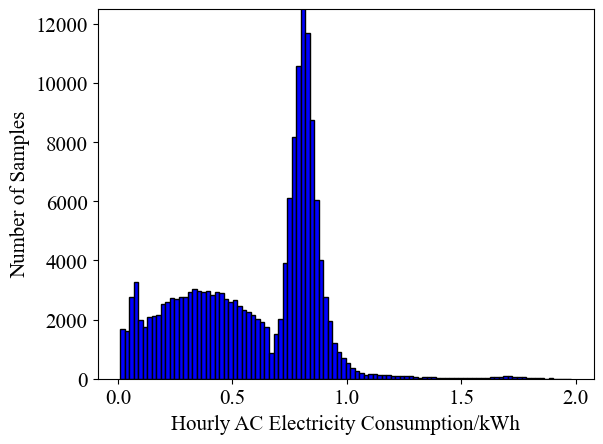
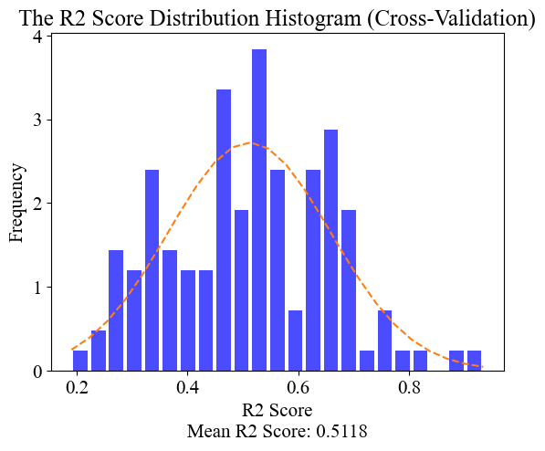
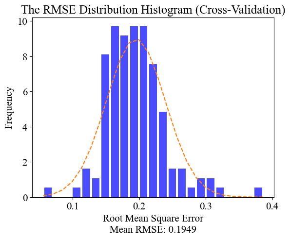
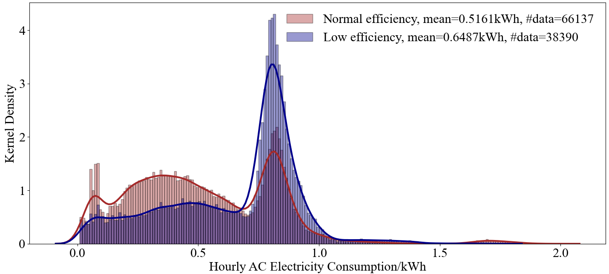

# Data-driven Smart Assessment of Inefficient AC detection

This is the code repository for the paper ***Data-driven Assessment of Room Air Conditioner Efficiency for Saving
Energy*** published in
the [Journal of Cleaner Production](https://www.journals.elsevier.com/journal-of-cleaner-production), you can find the
paper directly through **[here](https://doi.org/10.1016/j.jclepro.2022.130615)**.

## 1. Citing this work

Please use the Bibtex below for citation of this work:

```
@article{wang2022data,
  title={Data-driven assessment of room air conditioner efficiency for saving energy},
  author={Wang, Weiqi and Zhou, Zixuan and Lu, Zhongming},
  journal={Journal of Cleaner Production},
  pages={130615},
  year={2022},
  publisher={Elsevier}
}
```

## 2. Environment Setup

The experiment is conducted under Windows 10 with Python 3.7/3.8 as the developing environment.

Use the following code segment to install all the required packages:

```commandline
pip install -r requirements.txt
```

The following code segment is for updating the *pip*:

```commandline
python -m pip install --upgrade pip
```

## 3. Data Compilation

***Due to the privacy issues, the dataset will not be made open to public.***

However, we still provide a 200
lines [sample version](https://github.com/MighTy-Weaver/Inefficient-AC-detection/blob/main/demo/sample_data.csv) of the
full dataset to demonstrate the formation of our experimenting data, and you can check the `data_compilation.py` for how
our data is compiled from different categories of data.

*Remarks: Please notice that the `Location` in `sample_data.csv` are set to 0 for privacy.*

## 4. Training the XGBoost Model

Again, you must have all the packages above installed.

Run the `training_xgboost_model.py` to train the model, we use xgboost squared regressor and cross validation to do the
training. Each room's model has been boosted for 300 rounds under 10 folds of cross-validation, and we used
the [SMOTE](https://doi.org/10.1613/jair.953) algorithm to help with the imbalance distribution of the data.

Here is a simple demonstration of the data distribution before the [SMOTE](https://doi.org/10.1613/jair.953) algorithm.


After the [SMOTE](https://doi.org/10.1613/jair.953) algorithm, the distribution for AC below or above 0.7 is balanced.


Models will be dumped into `models` folder, and two csv files will be generated, recording the information about results
after cross validation and the real-prediction value of each room.

We provide some statistical results by the XGBoost models.



## 5. Result Visualization

After you've trained the models, run the `prediction_processing.py` to generate the visual graphs of the result.

It will generate distribution plot for each room, interactive shapley value for each room's model, an overall RMSE
histogram and an overall accuracy distribution histogram.

For detail about the Shapley value, please refer to [Shapley Additive Explanation](https://github.com/slundberg/shap).

The graphs will be dumped into three folders: `distribution_plot`, `shap_TH_ac_plot` and the current work directory.

At the same time, there are also some codes for other visualizations used in the paper:

`SMOTE_plot_demonstration.py` is the code for plotting the difference before and after
SMOTE, `room_comparison_plotting.py` is for comparison among high/mid/low efficiency ACs.

In general, this a plot for our result:


## 6. Acknowledgement

This project was supported by the [Undergraduate Research Opportunity Program (UROP)](https://urop.ust.hk/) of The Hong
Kong University of Science and Technology (HKUST), and the [Sustainable Smart Campus](https://ssc.hkust.edu.hk/) project
of HKUST. The views and ideas expressed here belong solely to the authors and not to the funding agencies.

## 7. Acknowledgement

If you have any question, feel free to email me at `1874240442@qq.com`. This email will be active all the time. 