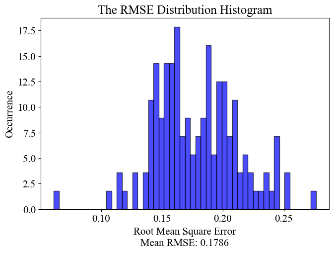

# Inefficient-AC-detection

This is the code repository for the paper **<font color=red>TO BE UPDATED</font>**, you can find the paper directly
through **[here](https://www.google.com)** **<font color=red>TO BE UPDATED</font>**

## 1. Environment Setup

The experiment is conducted under: Windows 10 with Python 3.7/3.8 as the developing environment.

Use `pip install -r requirements.txt` to install all the packages.

Alternatively, you can manually install these packages, they must be installed correctly to conduct the
experiment: **`xgboost, numpy, seaborn, matplotlib, pandas, shap, warnings, scikit-learn`**

## 2. Data Compilation

***Due to the privacy issues, the dataset will not be made open to public.***

However, we still provide a 200
lines [sample version](https://github.com/MighTy-Weaver/Inefficient-AC-detection/blob/main/sample_data.csv) of the full
dataset to demonstrate the formation of our experimenting data, and you can check the `data_compilation.py` for how our
data is compiled from different categories of data.

*Remarks: Please notice that the `Location` in `sample_data.csv` are set to 0 for privacy.*

## 3. Training the XGBoost Model

Again, you must have all the packages above installed.

Run the `room_xgboost_training.py` to train the model, we use xgboost squared regressor and cross validation to do the
training. Each room's model has been boosted for 300 rounds under 10 folds of cross-validation, and we used
the [SMOTE](https://doi.org/10.1613/jair.953) algorithm to help with the imbalance distribution of the data.

Here is a simple demonstration of the data distribution before the [SMOTE](https://doi.org/10.1613/jair.953) algorithm.


After the [SMOTE](https://doi.org/10.1613/jair.953) algorithm, the distribution for AC below or above 0.7 is balanced.


Models will be dumped into `models` folder, and two csv files will be generated, recording the information about results
after cross validation and the real-prediction value of each room.

We provide some demonstrations of the results by the XGBoost models.



## 4. Result Visualization

After you've trained the models, run the `prediction_processing.py` to generate the visual graphs of the result.

It will generate distribution plot for each room, interactive shapley value for each room's model, an overall RMSE
histogram and an overall accuracy distribution histogram.

For detail about the Shapley value, please refer to [Shapley Additive Explanation](https://github.com/slundberg/shap)

The graphs will be dumped into three folders: `distribution_plot`, `shap_TH_ac_plot` and the current work directory.

At the same time, there are also some codes for other visualizations used in the paper.

`SMOTE_plot_demonstration.py` is the code for plotting the difference before and after
SMOTE, `room_comparison_plotting.py` is for comparison among high/mid/low efficiency ACs.

## 5. Acknowledgement

This project is conducted under the supervision
of [Prof.Lu Zhongming](https://facultyprofiles.ust.hk/profiles.php?profile=zhongming-lu-zhongminglu).

If you have any question related to this project, feel free
to [raise up an issue](https://github.com/MighTy-Weaver/Inefficient-AC-detection/issues).

## 6. Citing this work **<font color=red>TO BE UPDATED</font>**

Please use the Bibtex below for citation of this work

```
Bibtex TO BE UPDATED
```
